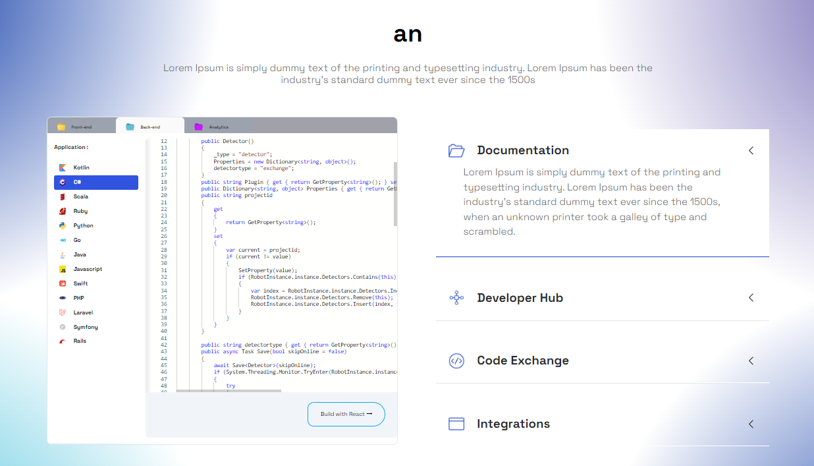

<p align="center">
  <a href="https://nextjs.org">
    <picture>
      <source media="(prefers-color-scheme: dark)" srcset="https://assets.vercel.com/image/upload/v1662130559/nextjs/Icon_dark_background.png">
      
    </picture>
    <h1 align="center">Next.js</h1>
  </a>
</p>

## About 

Next.js is a framework that makes it easy to create 'universal' React apps - React apps that do both client and server side rendering.

With Next.js, React pages are automatically rendered on both client and server side, without the hassle of setting up dependancies like webpack or babel and with automatic routing and without the constraints of projects like Create React App.

## Getting Started

This is a [Next.js](https://nextjs.org/) project bootstrapped with [`create-next-app`](https://github.com/vercel/next.js/tree/canary/packages/create-next-app).

To run this example, simply do:

```sh
npm install
cd client
npm run dev
```

Open [http://localhost:3000](http://localhost:3000) with your browser to see the result.

Then you will see a simple web page with 1 page like this:



You can start editing the page by modifying `pages/index.tsx`. 
The page auto-updates as you edit the file.

## Learn More

To learn more about Next.js, take a look at the following resources:

- [Next.js Documentation](https://nextjs.org/docs) - learn about Next.js features and API.
- [Learn Next.js](https://nextjs.org/learn) - an interactive Next.js tutorial.

You can check out [the Next.js GitHub repository](https://github.com/vercel/next.js/) - your feedback and contributions are welcome!

## Community

To chat with other community members you can join the Next.js [Discord](https://nextjs.org/discord) server.

## Deploy on Vercel

The easiest way to deploy your Next.js app is to use the [Vercel Platform](https://vercel.com/new?utm_medium=default-template&filter=next.js&utm_source=create-next-app&utm_campaign=create-next-app-readme) from the creators of Next.js.

Check out our [Next.js deployment documentation](https://nextjs.org/docs/deployment) for more details.

## What the repository is for 

This website develops widgets that allow customers to export widgets and edit and configure them for use on landing pages.

The deliverable is a repository with a React project containing all the tools for the customer to generate JS and CSS files to be imported into an HTML landing page along with custom HTML tags (e.g. divs with special IDs) with full widgets. 

Rendered from generated JS/CSS.

## How to edit files each language the widget

1. **Organize Language Files**: Create separate language files for each supported language in your project. These files can be JSON, JavaScript, or any other format that is convenient for storing language translations and text.

2. **Implement Language Switching**: Add functionality to your widget component to support language switching. This may involve loading the appropriate language file based on user preferences or the selected language.

3. **Update Text Content Dynamically**: Use the language data from the selected language file to dynamically update text content within your widget component. This ensures that the widget displays text in the correct language based on user preferences.

4. **Provide Configuration Options**: Allow clients to specify the desired language for the widget through configuration options. This enables them to customize the language settings according to their target audience or preferences.

By following these steps, you can develop a widget in a Next.js project that supports multiple languages and can be easily configured and exported for use in client landing pages.

## How to add/remove a language from the widget

1. **Create a Language Configuration Component**: Develop a React component within your Next.js project that allows clients to manage the languages for the widget. This component could include options to add, remove, or modify languages.

2. **Language Data Management**: Store the language data for the widget in a structured format, such as JSON files or a database. Each language should have a unique identifier and include translations for the widget's content.

3. **Add Language Functionality**: Implement functionality within the configuration component to allow clients to add new languages to the widget. This could involve providing a form where clients can enter the language name, code, and translations.

4. **Remove Language Functionality**: Similarly, implement functionality to allow clients to remove languages from the widget. This could be achieved by providing a list of currently added languages with options to delete individual languages.

5. **Update Widget Configuration**: When a client adds or removes a language, update the widget's configuration accordingly. This may involve updating the language data and re-generating the JavaScript and CSS files for the widget to include or exclude the selected languages.

6. **Re-generate Widget Files**: Trigger the regeneration of the JavaScript and CSS files for the widget whenever the language configuration changes. This ensures that the exported widget files include the updated language settings.

## How to add/remove a tab from the widget

1. Set up a Next.js project: Begin by setting up a Next.js project on your local machine. Make sure you have Node.js and npm (Node Package Manager) installed.

2. Create a new React component: In your Next.js project, create a new React component that represents the content of the tab you want to add. This component should contain the necessary logic and UI elements for the tab's functionality.

3. Modify the widget component: Locate the component that renders the widget in your Next.js project. This component is responsible for rendering the entire widget, including the tabs. Update the component to include the new tab component you created in Step 2. Make sure to update any relevant state or data structures to handle the addition of the new tab.

4. Remove an existing tab: To remove a tab, locate the component associated with the tab you want to remove. Remove the corresponding code responsible for rendering the tab and any related logic. Update any relevant state or data structures accordingly.

5. Configure routing (optional): If you want to support navigation between different tabs, you can configure routing in Next.js. You can use a routing library like Next.js's built-in `next/router` or a third-party library like `react-router-dom` to handle the navigation.

6. Test and verify the changes: After making the modifications, test the Next.js project locally to ensure the new tab is added or the existing tab is removed as intended. Verify that the widget functions correctly with the updated tab configuration.

7. Build the project: Once you're satisfied with the changes, build the Next.js project to generate the optimized JS and CSS files. You can use the `next build` command to build the project.

8. Share the updated files: Provide your clients with the updated JS and CSS files generated by the Next.js build process. Instruct them to import these files into their HTML landing pages using the appropriate script and link tags.

9. Instruct clients on widget integration: Document and provide instructions to your clients on how to integrate the widget into their HTML landing pages. This should include details on importing the JS and CSS files, adding the custom HTML tag (e.g., a div with a special ID), and any additional configuration steps.
